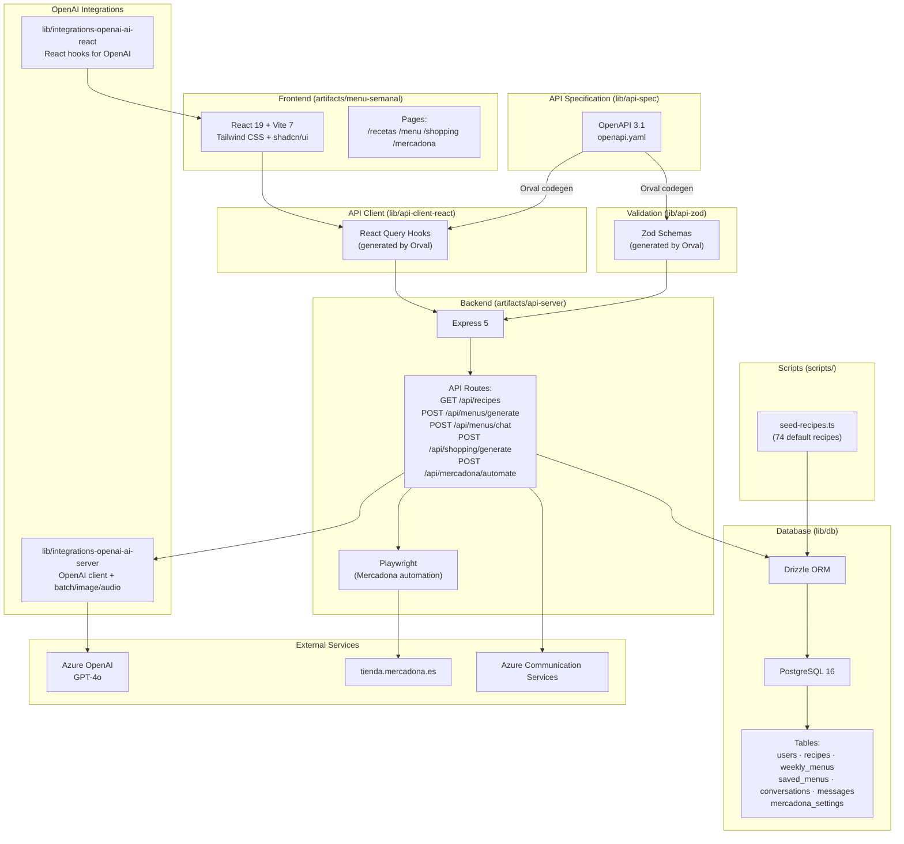

# La Cocina — Weekly Menu Planner

A full-stack web application for weekly meal planning powered by a conversational AI agent, personal recipe management, automated shopping list generation, and Mercadona grocery cart automation.

## Features

- **Recipe Management** — Browse and manage personal recipes organized by type (first course, second course, other). New users are seeded with 74 default recipes.
- **AI Menu Generation** — Generate weekly menus using Azure OpenAI GPT-4o. The AI respects historical preferences (5 weeks of learning), parses natural-language constraints (e.g. "no fish at lunch", "only seconds"), and enforces them programmatically as a safeguard.
- **Conversational Menu Editing** — Refine and modify menus incrementally through a chat interface with full context awareness. The AI assistant only changes what you ask for.
- **Drag & Drop** — Visually rearrange meals across days and slots.
- **Shopping List** — Auto-consolidated ingredient list generated from the active menu, grouped by normalized ingredient with recipe attribution.
- **Mercadona Automation** — Playwright-based browser automation that searches Mercadona's product API and adds ingredients to your online cart.
- **PDF Export** — Export menus as A4 landscape table-format PDFs using a custom pure-Node generator (no external dependencies).
- **Email** — Send menus via Azure Communication Services with PDF attachments. Includes welcome emails on registration.
- **Multi-User** — Per-user recipes, menus, AI settings, and credentials. Password authentication with email-based reset tokens.

## Tech Stack

| Layer | Technologies |
|-------|-------------|
| **Frontend** | React 19, Vite 7, Tailwind CSS 4, shadcn/ui (Radix UI), Framer Motion, React Query, Wouter |
| **Backend** | Express 5, Node.js, Pino (logging), Helmet |
| **Database** | PostgreSQL 16, Drizzle ORM |
| **AI** | Azure OpenAI GPT-4o via `@azure/identity` (Entra ID / Managed Identity) |
| **Validation** | Zod, Drizzle-Zod |
| **API** | OpenAPI 3.1, Orval (code generation) |
| **Automation** | Playwright + puppeteer-extra-plugin-stealth (Mercadona) |
| **Email** | Azure Communication Services |
| **Monorepo** | pnpm workspaces, TypeScript 5.9 (composite projects) |
| **Deployment** | Docker (multi-stage), Render.com, Azure App Service / Container Apps |

## Architecture



## Monorepo Structure

```
menu-planner/
├── artifacts/                          # Deployable applications
│   ├── api-server/                     # Express 5 API server
│   ├── menu-semanal/                   # React + Vite frontend
│   └── mockup-sandbox/                 # UI component sandbox
├── lib/                                # Shared libraries
│   ├── api-spec/                       # OpenAPI 3.1 spec + Orval config
│   ├── api-client-react/               # Generated React Query hooks
│   ├── api-zod/                        # Generated Zod schemas
│   ├── db/                             # Database layer (Drizzle ORM)
│   ├── integrations-openai-ai-server/  # OpenAI integration (server)
│   └── integrations-openai-ai-react/   # OpenAI integration (React)
├── scripts/                            # Utility scripts
├── pnpm-workspace.yaml                 # Workspace configuration
├── tsconfig.base.json                  # Shared TS options
└── tsconfig.json                       # Project references
```

## Packages

### `artifacts/api-server`

Express 5 API server. Routes use `@workspace/api-zod` for validation and `@workspace/db` for persistence.

- **Entry**: `src/index.ts` — reads `PORT`, runs auto-migration, seeds initial data, starts the server
- **Routes**: mounted at `/api` (health, users, recipes, menus, shopping, mercadona, email, ai-chat, saved-menus)
- **Auth**: `X-User-Id` header-based authentication with user lookup
- **Build**: esbuild bundles to CJS (`dist/index.cjs`)

### `artifacts/menu-semanal`

React + Vite frontend with shadcn/ui and Tailwind CSS.

- **Pages**: Recipes, Weekly Menu, Shopping List, Mercadona
- **Data**: React Query with hooks generated from `@workspace/api-client-react`
- **Interaction**: Drag & drop menu editing, conversational AI chat

### `lib/api-spec`

OpenAPI 3.1 specification (`openapi.yaml`) and Orval configuration. Code generation produces:
- React Query hooks → `lib/api-client-react/src/generated/`
- Zod schemas → `lib/api-zod/src/generated/`

### `lib/db`

Database layer with Drizzle ORM and PostgreSQL.

**Tables**:
| Table | Description |
|-------|-------------|
| `users` | User profiles with auth, avatar, and per-user Azure OpenAI settings |
| `password_reset_tokens` | Time-limited password reset tokens |
| `recipes` | Recipes with name, category (primero/segundo/otro), ingredients, and instructions |
| `weekly_menus` | AI-generated weekly menus (JSONB: 7 days × lunch/dinner with 4 slots each) |
| `saved_menus` | Archived/saved menus with labels |
| `conversations` | Chat conversation history |
| `messages` | Individual chat messages |
| `mercadona_settings` | Mercadona credentials and session tokens |

### `lib/integrations-openai-ai-server`

Server-side OpenAI integration utilities: client, batch processing, image generation, and audio processing.

### `lib/integrations-openai-ai-react`

React hooks for OpenAI integration, including audio hooks.

## API

| Method | Route | Description |
|--------|-------|-------------|
| `GET` | `/api/health` | Health check |
| `GET` | `/api/recipes` | List recipes (filter by category) |
| `POST` | `/api/recipes` | Create recipe |
| `GET` | `/api/recipes/:id` | Get recipe by ID |
| `PUT` | `/api/recipes/:id` | Update recipe |
| `DELETE` | `/api/recipes/:id` | Delete recipe |
| `POST` | `/api/menus/generate` | Generate weekly menu with AI |
| `POST` | `/api/menus/chat` | Conversational chat to edit menu |
| `GET` | `/api/menus` | List user menus |
| `GET` | `/api/menus/:id` | Get specific menu |
| `PATCH` | `/api/menus/:id` | Update menu days (drag & drop) |
| `DELETE` | `/api/menus/:id` | Delete menu |
| `POST` | `/api/shopping-list/generate` | Generate shopping list from menu |
| `GET` | `/api/shopping-list/:menuId` | Get shopping list |
| `GET` | `/api/mercadona/credentials` | Check Mercadona credentials |
| `POST` | `/api/mercadona/credentials` | Save credentials |
| `DELETE` | `/api/mercadona/credentials` | Delete credentials |
| `POST` | `/api/mercadona/automate` | Run Mercadona cart automation |
| `POST` | `/api/saved-menus` | Save/archive a menu |
| `GET` | `/api/saved-menus` | List saved menus |
| `GET` | `/api/saved-menus/:id/pdf` | Export saved menu as PDF |
| `POST` | `/api/email/send-menu` | Send menu via email with PDF |
| `POST` | `/api/users/login` | Login |
| `POST` | `/api/users/register` | Register new user |

## Development

### Prerequisites

- Node.js 24
- pnpm
- PostgreSQL 16

### Setup

```bash
pnpm install
```

### Commands

```bash
# Full monorepo typecheck
pnpm run typecheck

# Production build
pnpm run build

# API server (dev)
pnpm --filter @workspace/api-server run dev

# Frontend (dev)
pnpm --filter @workspace/menu-semanal run dev

# Generate code from OpenAPI spec
pnpm --filter @workspace/api-spec run codegen

# Seed initial recipes
pnpm --filter @workspace/scripts run seed-recipes

# Push database schema
pnpm --filter @workspace/db run push
```

### Environment Variables

| Variable | Description |
|----------|-------------|
| `PORT` | Server port (default: 3000) |
| `DATABASE_URL` | PostgreSQL connection string |
| `AZURE_TENANT_ID` | Azure AD tenant ID |
| `AZURE_CLIENT_ID` | Azure AD client ID |
| `AZURE_CLIENT_SECRET` | Azure AD client secret |
| `AZURE_OPENAI_BASE_URL` | Azure OpenAI endpoint |
| `AZURE_OPENAI_MODEL` | Azure OpenAI deployment name |

## Data Flow

### Menu Generation

1. User requests a menu through the chat interface
2. Frontend sends `POST /api/menus/generate` with preferences
3. Server loads user recipes and historical context (5 weeks of learned preferences)
4. Prompt is sent to Azure OpenAI GPT-4o with structured JSON format
5. AI generates a weekly menu (7 days × lunch/dinner with recipe IDs)
6. Constraints are programmatically enforced post-AI as a safeguard
7. Menu is saved to `weekly_menus` table and returned to frontend

### Chat Refinement

1. User writes a change request in the chat
2. Frontend sends `POST /api/menus/chat` with the message, history, and current menu
3. Server builds full context: current menu, all recipes, conversation history, accumulated constraints
4. Azure OpenAI processes the current menu alongside the change request
5. AI returns only the modified portions; server merges with existing menu
6. Frontend updates the UI, supporting further drag & drop edits

### Shopping Automation

1. User generates a shopping list from the active menu
2. Ingredients are consolidated and normalized across all recipes
3. User triggers Mercadona automation with saved credentials
4. Playwright searches Mercadona's product API for each ingredient
5. Matching products are added to the online cart automatically

## Deployment

The project uses a multi-stage Docker build:
1. **deps** — Install pnpm dependencies
2. **build-server** — Build API with esbuild → `dist/index.cjs`
3. **build-client** — Build frontend with Vite, pre-compress with gzip
4. **runtime** — Node 20-slim, serves on port 3000

Deployed on Render.com (Docker + PostgreSQL) and Azure (App Service / Container Apps).

## License

MIT
