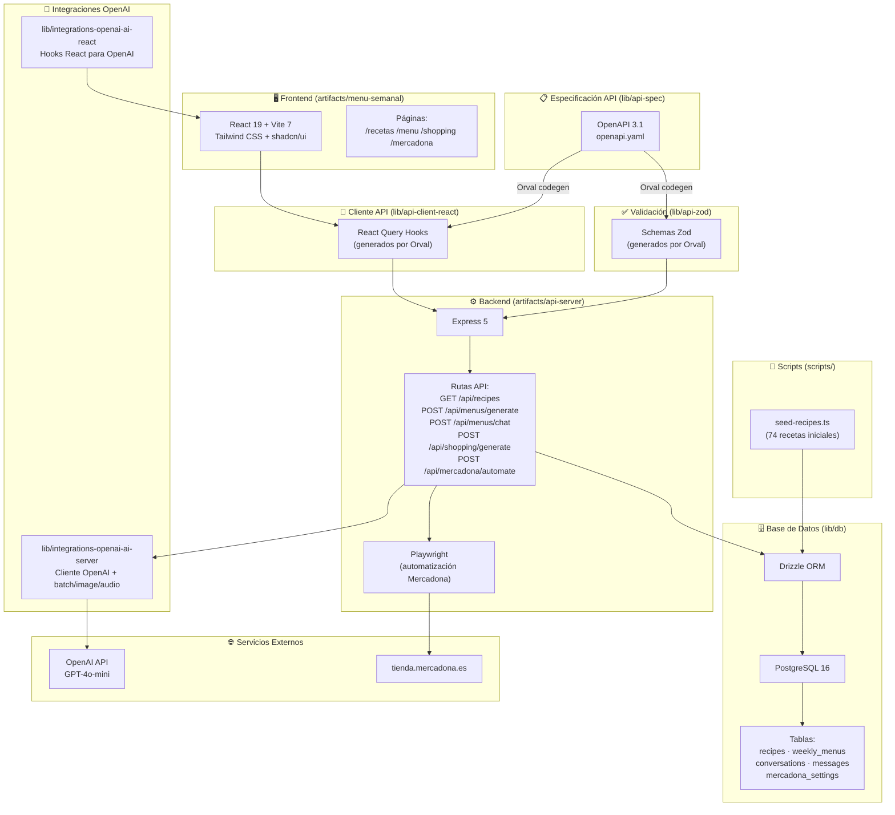

# 🍳 La Cocina — Planificador de Menú Semanal

Aplicación web para la planificación semanal de comidas con un agente de IA conversacional, gestión de recetas personales y automatización de compra en Mercadona.

## Características

- **Recetas** — Navega y gestiona 74 recetas personales organizadas por tipo (primero, segundo, otro)
- **Menú Semanal** — Genera menús semanales mediante un agente conversacional con IA (OpenAI GPT-4o-mini). Edita con drag & drop e imprime en formato horizontal
- **Lista de Compra** — Genera una lista de compra consolidada a partir del menú semanal
- **Mercadona** — Automatización con Playwright para añadir ingredientes al carrito de tienda.mercadona.es

## Stack Tecnológico

| Capa | Tecnologías |
|------|-------------|
| **Frontend** | React 19, Vite 7, Tailwind CSS 4, shadcn/ui (Radix UI), Framer Motion, React Query, Wouter |
| **Backend** | Express 5, Node.js 24, Pino (logging) |
| **Base de datos** | PostgreSQL 16, Drizzle ORM |
| **IA** | OpenAI GPT-4o-mini (generación de menús y chat conversacional) |
| **Validación** | Zod, Drizzle-Zod |
| **API** | OpenAPI 3.1, Orval (generación de código) |
| **Automatización** | Playwright + puppeteer-extra-plugin-stealth (Mercadona) |
| **Monorepo** | pnpm workspaces, TypeScript 5.9 (composite projects) |

## Arquitectura



## Estructura del Monorepo

```
menu-planner/
├── artifacts/                          # Aplicaciones desplegables
│   ├── api-server/                     # Servidor API Express 5
│   ├── menu-semanal/                   # Frontend React + Vite
│   └── mockup-sandbox/                 # Sandbox de componentes UI
├── lib/                                # Librerías compartidas
│   ├── api-spec/                       # Especificación OpenAPI 3.1 + config Orval
│   ├── api-client-react/               # Hooks React Query generados
│   ├── api-zod/                        # Schemas Zod generados
│   ├── db/                             # Capa de base de datos (Drizzle ORM)
│   ├── integrations-openai-ai-server/  # Integración OpenAI (servidor)
│   └── integrations-openai-ai-react/   # Integración OpenAI (React)
├── scripts/                            # Scripts de utilidad
├── pnpm-workspace.yaml                 # Configuración del workspace
├── tsconfig.base.json                  # Opciones TS compartidas
└── tsconfig.json                       # Referencias de proyectos
```

## Paquetes

### `artifacts/api-server`

Servidor API Express 5. Las rutas usan `@workspace/api-zod` para validación y `@workspace/db` para persistencia.

- **Entrada**: `src/index.ts` — lee `PORT`, siembra datos iniciales y arranca el servidor
- **Rutas**: montadas en `/api` (health, recipes, menus, shopping, mercadona)
- **Build**: esbuild genera un bundle CJS (`dist/index.cjs`)

### `artifacts/menu-semanal`

Frontend React + Vite con diseño shadcn/ui y Tailwind CSS.

- **Páginas**: Recetas, Menú Semanal, Lista de Compra, Mercadona
- **Datos**: React Query con hooks generados desde `@workspace/api-client-react`
- **Interacción**: Drag & drop para editar menús, chat conversacional con IA

### `lib/api-spec`

Especificación OpenAPI 3.1 (`openapi.yaml`) y configuración de Orval. El codegen genera:
- Hooks React Query → `lib/api-client-react/src/generated/`
- Schemas Zod → `lib/api-zod/src/generated/`

### `lib/db`

Capa de base de datos con Drizzle ORM y PostgreSQL.

**Tablas**:
- `recipes` — 74 recetas con nombre, descripción, ingredientes y tipo
- `weekly_menus` — menús semanales generados por IA (JSON con 7 días × comida/cena)
- `conversations` — historial de conversaciones con el agente
- `messages` — mensajes individuales del chat
- `mercadona_settings` — credenciales para la automatización de Mercadona

### `lib/integrations-openai-ai-server`

Utilidades de integración con OpenAI del lado del servidor: cliente, procesamiento por lotes, generación de imágenes y procesamiento de audio.

### `lib/integrations-openai-ai-react`

Hooks de React para la integración con OpenAI, incluyendo hooks de audio.

## API

| Método | Ruta | Descripción |
|--------|------|-------------|
| `GET` | `/api/health` | Health check |
| `GET` | `/api/recipes` | Listar recetas (filtro por categoría) |
| `POST` | `/api/recipes` | Crear receta |
| `PUT` | `/api/recipes/:id` | Actualizar receta |
| `DELETE` | `/api/recipes/:id` | Eliminar receta |
| `POST` | `/api/menus/generate` | Generar menú semanal con IA |
| `POST` | `/api/menus/chat` | Chat conversacional para editar menú |
| `GET` | `/api/menus` | Listar menús guardados |
| `POST` | `/api/shopping/generate` | Generar lista de compra desde menú |
| `GET` | `/api/shopping/:menuId` | Obtener lista de compra |
| `GET` | `/api/mercadona/credentials` | Comprobar credenciales Mercadona |
| `POST` | `/api/mercadona/credentials` | Guardar credenciales |
| `DELETE` | `/api/mercadona/credentials` | Eliminar credenciales |
| `POST` | `/api/mercadona/automate` | Ejecutar automatización Mercadona |

## Desarrollo

### Requisitos

- Node.js 24
- pnpm
- PostgreSQL 16

### Instalación

```bash
pnpm install
```

### Comandos principales

```bash
# Typecheck completo del monorepo
pnpm run typecheck

# Build de producción
pnpm run build

# Servidor API en desarrollo
pnpm --filter @workspace/api-server run dev

# Frontend en desarrollo
pnpm --filter @workspace/menu-semanal run dev

# Generación de código desde OpenAPI
pnpm --filter @workspace/api-spec run codegen

# Siembra de recetas iniciales
pnpm --filter @workspace/scripts run seed-recipes

# Push de esquema a la base de datos
pnpm --filter @workspace/db run push
```

## Flujo de Datos

### Generación de Menú

1. El usuario solicita un menú en el chat conversacional
2. El frontend envía `POST /api/menus/generate` con preferencias
3. El servidor carga recetas y contexto histórico (5 semanas de preferencias aprendidas)
4. Se envía el prompt a OpenAI GPT-4o-mini con formato JSON
5. La IA genera un menú semanal (7 días × comida/cena con IDs de receta)
6. Se guarda en la tabla `weekly_menus` y se devuelve al frontend

### Refinamiento por Chat

1. El usuario escribe una solicitud de cambio en el chat
2. El frontend envía `POST /api/menus/chat` con el mensaje y el historial
3. El servidor reconstruye el contexto de conversación desde la tabla `messages`
4. OpenAI procesa el menú actual junto con la solicitud de cambio
5. Devuelve el menú actualizado y la respuesta de la IA
6. El frontend actualiza la interfaz con edición drag & drop

## Licencia

MIT
